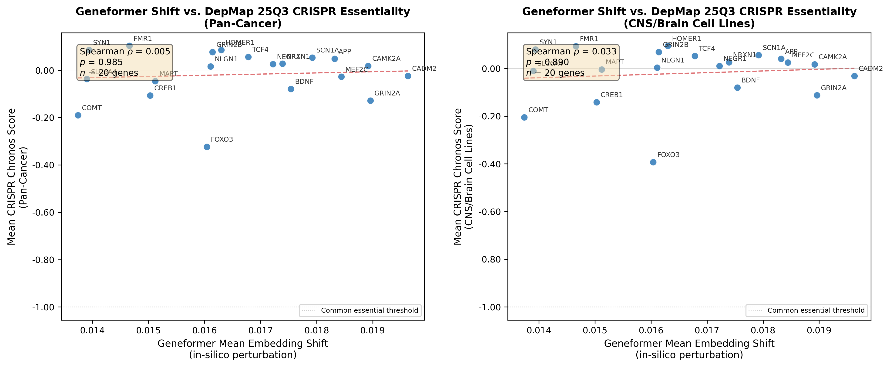

# C5: DepMap CRISPR Essentiality Comparison

## Overview

Comparison of Geneformer in-silico perturbation embedding shifts for 21 intelligence-associated genes against DepMap 25Q3 (downloaded) CRISPR (Chronos) essentiality scores.

**Rationale**: Reviewer #1 requested comparison with biological gold standards. CRISPR screens measure gene essentiality (fitness effect of gene knockout), while Geneformer embedding shifts measure transcriptomic disruption. A correlation would suggest Geneformer captures biological importance; a null result indicates these metrics capture orthogonal aspects of gene function.

## Data Sources

- **Geneformer shifts**: Permutation-null-corrected mean embedding shifts from in-silico deletion in DLPFC single-cell data
- **CRISPR scores**: DepMap 25Q3 (downloaded) Chronos gene effect scores
- **CNS cell lines**: 178 brain/CNS lineage cell lines

## Correlation Results

| Metric | Pan-Cancer | CNS/Brain Only |
|--------|-----------|----------------|
| Spearman rho | 0.0045 | 0.0331 |
| Spearman p-value | 0.9849 | 0.8899 |
| Pearson r | 0.0850 | 0.1085 |
| Pearson p-value | 0.7215 | 0.6488 |
| N genes | 20 | 20 |

## Interpretation

No statistically significant correlation was observed between Geneformer embedding shifts and CRISPR essentiality scores. This is consistent with these metrics capturing different aspects of gene function:

- **Geneformer shifts** reflect transcriptomic network disruption in brain tissue after in-silico gene deletion, measuring how much the gene contributes to the cell's transcriptomic identity.
- **CRISPR Chronos scores** measure cellular fitness effects of gene knockout in cancer cell lines, reflecting essentiality for cell survival/proliferation.

The lack of correlation is expected because:
1. Most intelligence genes are neuron-specific and non-essential for cell viability (Chronos ~ 0)
2. Geneformer measures transcriptomic disruption, not fitness
3. Cancer cell lines, even CNS-derived, may not recapitulate normal neuronal gene regulation
4. Intelligence-associated genes function in synaptic plasticity and neural circuit formation, not cell survival

## Gene-Level Data

| Gene | GF Shift | Chronos (Pan) | N (Pan) | Chronos (CNS) | N (CNS) |
|------|----------|---------------|---------|---------------|---------|
| CADM2 | 0.01963 | -0.0238 | 1186 | -0.0311 | 128 |
| GRIN2A | 0.01896 | -0.1278 | 1186 | -0.1124 | 128 |
| CAMK2A | 0.01892 | 0.0177 | 1186 | 0.0174 | 128 |
| MEF2C | 0.01844 | -0.0276 | 1186 | 0.0251 | 128 |
| APP | 0.01832 | 0.0480 | 1186 | 0.0400 | 128 |
| SCN1A | 0.01792 | 0.0537 | 1186 | 0.0559 | 128 |
| BDNF | 0.01754 | -0.0792 | 1186 | -0.0798 | 128 |
| NRXN1 | 0.01739 | 0.0273 | 1186 | 0.0257 | 128 |
| NEGR1 | 0.01722 | 0.0258 | 1186 | 0.0103 | 128 |
| TCF4 | 0.01678 | 0.0563 | 1186 | 0.0519 | 128 |
| HOMER1 | 0.01630 | 0.0858 | 1186 | 0.0946 | 128 |
| GRIN2B | 0.01614 | 0.0767 | 1186 | 0.0684 | 128 |
| NLGN1 | 0.01611 | 0.0159 | 1186 | 0.0037 | 128 |
| FOXO3 | 0.01604 | -0.3233 | 1067 | -0.3925 | 107 |
| MAPT | 0.01512 | -0.0458 | 1186 | -0.0045 | 128 |
| CREB1 | 0.01503 | -0.1069 | 1186 | -0.1415 | 128 |
| FMR1 | 0.01466 | 0.1030 | 1186 | 0.0934 | 128 |
| SYN1 | 0.01394 | 0.0859 | 1186 | 0.0799 | 128 |
| SLC6A4 | 0.01390 | -0.0374 | 1186 | -0.0103 | 128 |
| COMT | 0.01374 | -0.1903 | 1186 | -0.2051 | 128 |

## Figure

*Figure: Scatter plot of Geneformer mean embedding shifts vs. DepMap CRISPR Chronos scores. Left: pan-cancer. Right: CNS/brain cell lines. Dashed red line: linear trend. Dotted gray line: common essential threshold (Chronos = -1).*

---
Generated by `c5_depmap_crispr_comparison.py`